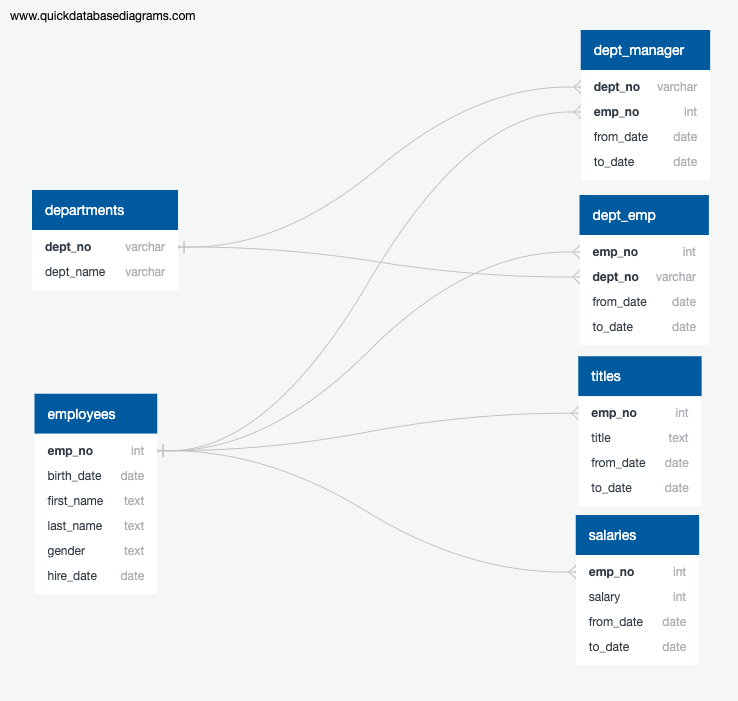

# sql-challenge
Data Modeling, Data Engineering, and Data Analysis of an employee DB using PostgreSQL

## Instructions

#### Data Modeling

After inspecting the CSVs in this this repo, I sketched out an ERD (Entity Relationship Diagram) of the tables. The tool used for this was [http://www.quickdatabasediagrams.com](http://www.quickdatabasediagrams.com).

#### Data Engineering

* I used the information to create a table schema for each of the six CSV files. Specifying data types, primary keys, foreign keys, and other constraints.

* Imported each CSV file into the corresponding SQL table.

#### Data Analysis

In the SQL file you will find the queries that analyse the following specifications:

1. Details of each employee: employee number, last name, first name, gender, and salary.

2. Employees who were hired in 1986.

3. Manager of each department with the following information: department number, department name, the manager's employee number, last name, first name, and start and end employment dates.

4. Department of each employee with the following information: employee number, last name, first name, and department name.

5. Employees whose first name is "Hercules" and last names begin with "B."

6. Employees in the Sales department, including their employee number, last name, first name, and department name.

7. Employees in the Sales and Development departments, including their employee number, last name, first name, and department name.

8. In descending order, the frequency count of employee last names, i.e., how many employees share each last name.
